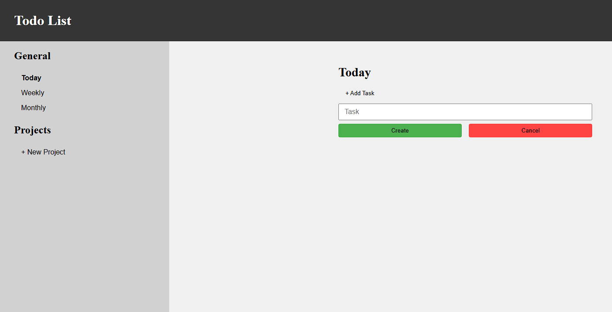

# Todo List

Simple todo list split into time categories and supporting new projects and project-specific tasks

Built as part of [The Odin Project](https://www.theodinproject.com/) curriculum to practice **Javascript modules**, **DOM manipulation**, and **state management in the form of localStorage**.

## Features

- Adding tasks based on time (daily, weekly, monthly)
- Adding tasks based on specific projects

## Demo

### [Live Demo](https://songzhang015.github.io/project-11-todo-list/)

## Built Using

- HTML
- CSS
- Javascript
